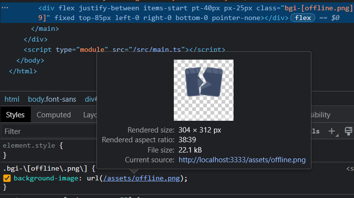
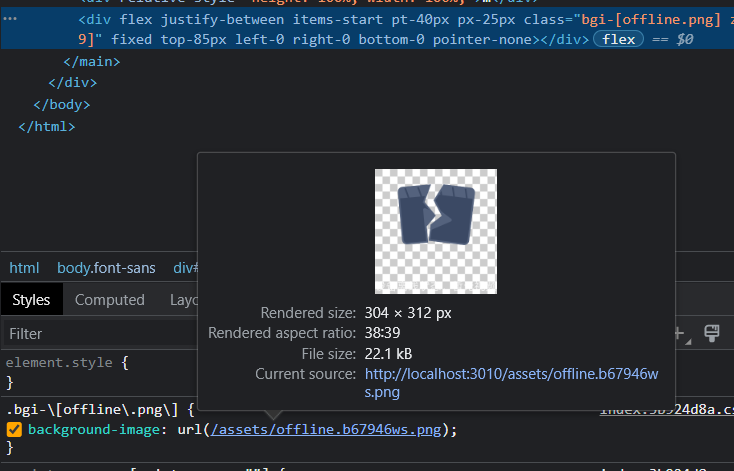

# vite-plugin-unocss-bgimg

<p align="center">
<a href="https://www.npmjs.com/package/vite-plugin-unocss-bgimg"></a>
</p>

## Features
- ServePlugin - the background image path parsed by the [Unocss](https://github.com/unocss/unocss) custom rules is mapped to the real image resource.
- BuildPlugin - pack the background image into ```./dist```, add a hash value to the background image and css.

## Resolve
In [Unocss](https://github.com/unocss/unocss), custom rules cannot handle static background image references, [which may cause errors in packaging](https://github.com/unocss/unocss/issues/1048) or [incorrect access positions of the packaged images](https://github.com/unocss/unocss/issues/1397).

The author gives some [suggestions](https://github.com/unocss/unocss/issues/1397#issuecomment-1221592140).

However, it is inevitable that there will still be a need to use static files as background images in projects. This plugin initially solves this problem.

## Usage
``` pnpm add vite-plugin-unocss-bgimg ```

```
// vite.config.ts
import UnocssBgImg from 'vite-plugin-unocss-bgimg'

...

export default defineConfig({
  ...
  plugins: [
    ...
    UnocssBgImg({
      src: './src/assets/bgimgs', // The path where the background image is stored
      dest: 'assets', // The location where the background image is stored after packaging.(ex: ./dist/assets/xxx.png  => dest: 'assets')
    }),
  ],
})

```

```
// unocss.config.ts
...

const imgTypeReg = /(http|https):\/\/([\w.]+\/?)\S*/

export default defineConfig({
  ...
  rules: [
    ...
    [/^bgi-\[([\w\W]+)\]$/, ([, d]) => {
      // '/assets' is the location of dest in your plugin configuration(dest: 'assets').
      const path = `${imgTypeReg.test(d) ? '' : '/assets/'}`
      return ({ 'background-image': `url('${path}${d}')` })
    }],
  ],
})

```

Now, you can use your custom rules for normal development, and the packaging will not report errors.

```
<template>
  <div class="bgi-[line.png]">
</template>

// line.png is stored in the location corresponding to src in the config(src: './src/assets/bgimgs').
```

<p align="center">



</p>

## License

[MIT](./LICENSE) License © 2022 [Enoch](https://github.com/enochzzz)
